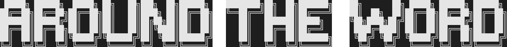
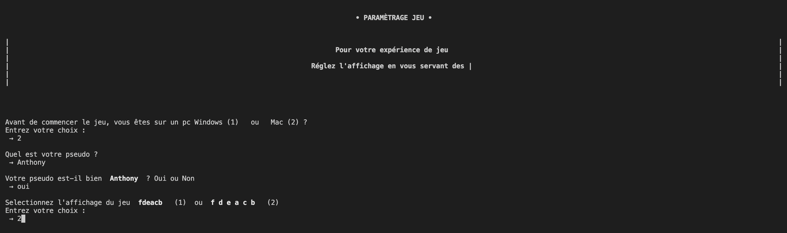
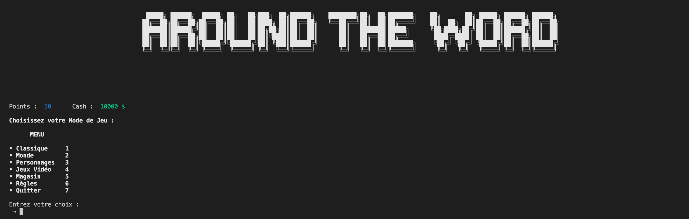
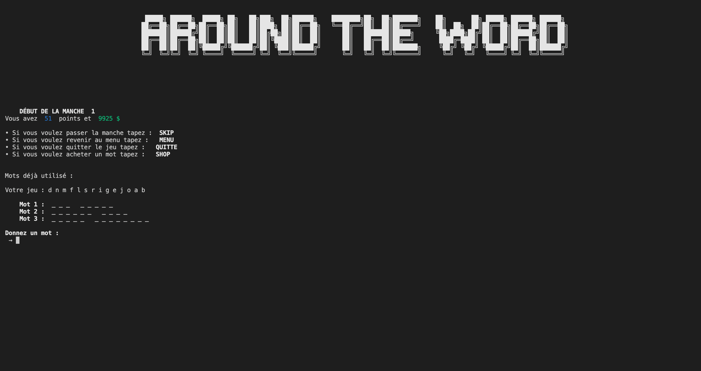
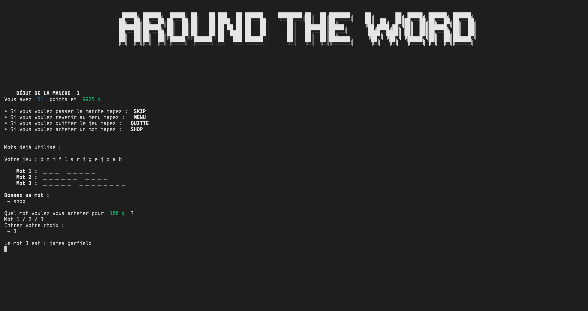
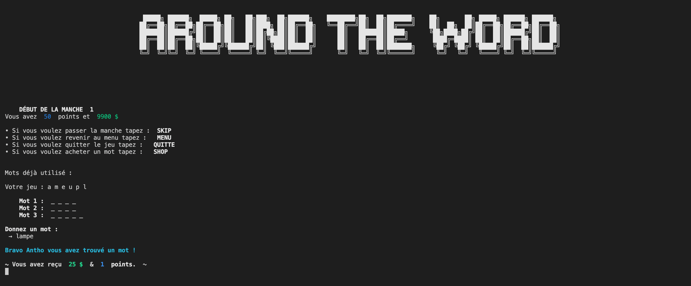
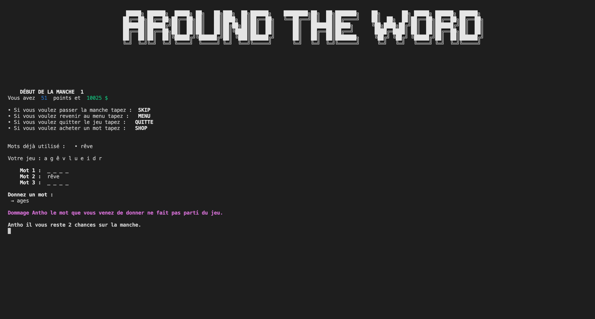
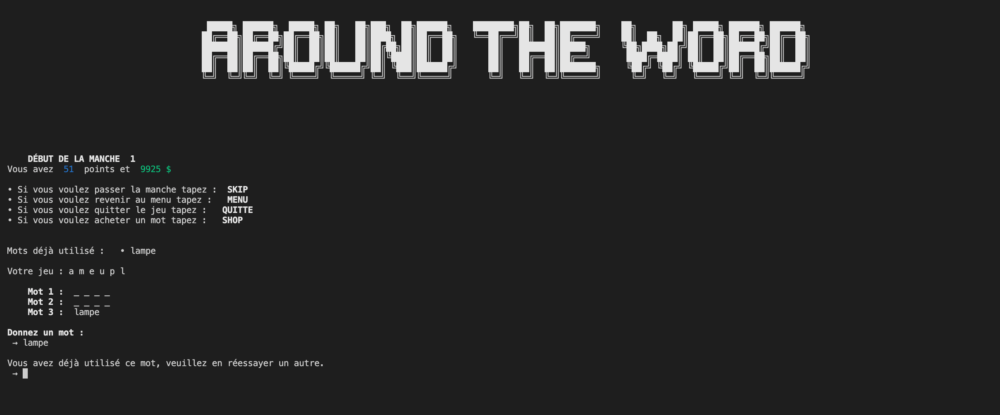
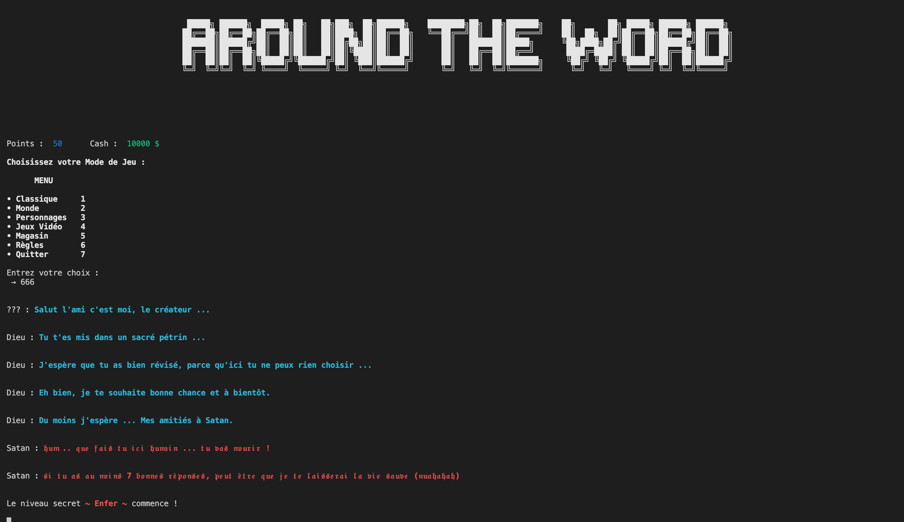
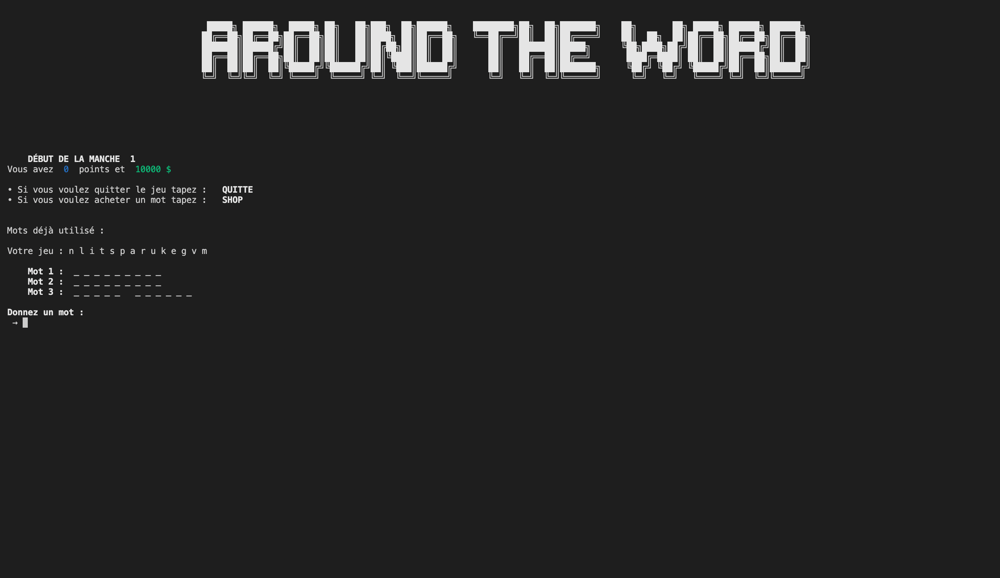

  

### 
• Scrabble sur console •

### But du jeu 
Around the Word est un jeu simple.   
Le but du jeu est de trouver les 3 mots cachés de la manche. Une partie se déroule en 3 manches.  
À chaque bonne réponse vous gagnez des points et du cash. Servez-vous en pour acheter des bonus dans le magasin ou en partie.  
Arriverez-vous à sortir victorieux de Around the Word ?

---

### 1. Pourquoi 
Dans le cadre d'un premier projet Python dans mon [école](https://www.hetic.net/), nous avons eu pour exercice de faire un Scrabble sur la console en Python. Lors de la réalisation de ce projet je savais coder depuis à peine 1 mois et je ne connaissais pas les classes. 

 

### 2. Contraintes imposées
- L'ordinateur doit séléctionner 3 mots d'une liste
- L'ordinateur doit décomposer chaque mots, mélanger les lettres des 3 mots et supprimer les lettres en double puis les afficher au joueur
- Le joueur doit deviner les 3 mots cachés. L'ordinateur doit dire si les propositions sont bonnes ou mauvaises
- Mettre une option pour que le joueur puisse quitter la manche

 

### 3. Objectifs bonus 
- Faire une "interface graphique" pour rendre le jeu plus agréable
- Section pour paramétrer le jeu avant le lancement : Plateforme Mac ou Windows (pour pouvoir clear la console), pseudo et affichage du jeu → ***photo 1***
- Menu pour choisir la catégorie de jeu (Classique, Monde, Personnages et Jeux Vidéos), le magasin pour acheter des bonus, les règles et pour pouvoir quitter le jeu → ***photo 2***
- 37 listes de mots pour une total de 1 688 mots différents → ***photo 3***
- Magasin avec possibilité d'acheter des bonus comme la première lettre de tous les mots à deviner, d'échanger ses points contre du cash ou d'acheter la victoire → ***photo 4***
- Si le mot à deviner comporte un espace, un tiret ou un apostrophe, le jeu les affiche et les supprime de la liste de lettres → ***photo 5***
- Pendant une partie il y a la possibilité de skip la manche, de retourner au menu, d'ouvrir un magasin pour acheter des mots de la manche et de quitter le jeu → ***photo 5***
- Les parties se déroulent en 3 manches de 3 mots à deviner, affichage des mots déjà mis avec blocage si le mot est répété et l'ordinateur affiche si le joueur a bien trouver le mot ou si il s'est trompé → ***photo 6***
- À chaque bonne réponse on gagne des points et du cash → ***photo 6***
- Mode de jeu caché en rentrant comme choix "666" dans le menu (attention si vous perdez, le jeu se termine). Dans ce mode de jeu toutes les listes sont mélangés → ***photo 7***
- Couleurs et clear automatique pour rendre l'interface plus jolie
- Jeu finit et impossible à faire crash (normalement)

 

### 4. Technologies utilisées

 

### 5. Photos pour illustrer le projet

#### Photo 1 → Paramétrer le jeu

  

#### Photo 2 → Menu du jeu

  

#### Photo 3 → Mode de jeu

  

#### Photo 4 → Magasin pour acheter des bonus

  

#### Photo 5 → Affichage pendant le jeu (affichage, shop de la manche)

    
   

#### Photo 6 → Réponses du joueur (bonne réponse, mauvaise réponse, déjà dis)

  
  
  

#### Photo 7 → Mode de jeu caché (dialogue, affichage du jeu)

  
  

